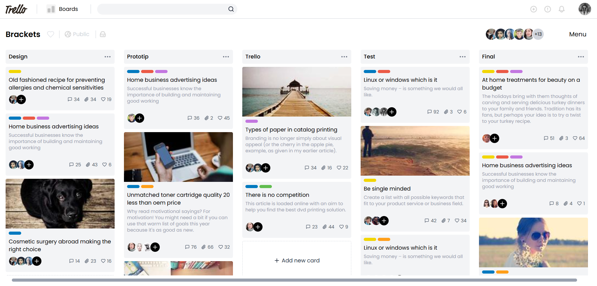

# Kanban Board - Trello Clone

A responsive Kanban board application built with React that mimics the core functionality of Trello. This project was created as part of the Rallybase React JS Intern Assignment.



## Features

- **Responsive Design**: Mobile-first approach that works seamlessly on all screen sizes
- **Interactive Lists**: Multiple customizable lists to organize tasks
- **Detailed Cards**: Cards with titles, descriptions, labels, and member assignments
- **Visual Metrics**: Track comments, attachments, and votes on each card
- **Custom Scrolling**: Optimized scrolling behavior for both desktop and mobile
- **API Integration**: Fetches data from a provided API endpoint

## Live Demo

[View the deployed application](https://kanban-board1-red.vercel.app/)

## Technologies Used

- React.js
- TypeScript
- Tailwind CSS
- Lucide React (for icons)
- Fetch API

## Running the Project Locally

### Prerequisites

- Node.js (v14 or later)
- npm or yarn

### Installation Steps

1. Clone the repository:
   ```bash
   git clone https://github.com/singhvishalrajput/Kanban-board.git
   cd kanban-board
   ```

2. Install dependencies:
   ```bash
   npm install
   # or
   yarn install
   ```

3. Start the development server:
   ```bash
   npm run dev
   # or
   yarn dev
   ```

4. Open your browser and navigate to `http://localhost:5173` or the port shown in your terminal.

## Project Structure

```
src/
├── assets/        # Static assets and images
├── components/    # React components
│   ├── BoardHeader.tsx
│   ├── BoardView.tsx
│   ├── Card.tsx
│   ├── List.tsx
│   └── ListContainer.tsx
├── types/         # TypeScript type definitions
├── App.tsx        # Main application component
└── index.css      # Global styles
```

## Component Overview

- **BoardView**: Main container for the entire board
- **BoardHeader**: Navigation and board information
- **ListContainer**: Horizontal scrollable container for lists
- **List**: Individual columns containing cards
- **Card**: Task cards with details, labels, and metrics

## API Integration

The application fetches data from a custom API endpoint that returns the board structure, lists, and cards. The response is processed and displayed according to the Figma design.

## Responsive Design

The application uses a mobile-first approach with:
- Horizontal scrolling for lists on mobile devices
- Vertical scrolling for cards within lists
- Custom scrollbar styling for desktop views
- Touch-optimized scrolling for mobile devices

## Challenges and Solutions

- **Mobile Scrolling**: Implemented custom scroll behavior with `overscroll-behavior` and `-webkit-overflow-scrolling: touch` for smooth iOS scrolling
- **Dynamic Height**: Used CSS calc() functions to ensure proper container heights across different screen sizes
- **Performance**: Optimized rendering of lists and cards to maintain smooth scrolling

## Future Improvements

- Drag and drop functionality for cards and lists
- Card creation and editing
- User authentication
- Real-time collaboration features

## Contact

For any questions or feedback, please reach out at [iamvishalrajput31@gmail.com](mailto:iamvishalrajput31@gmail.com)